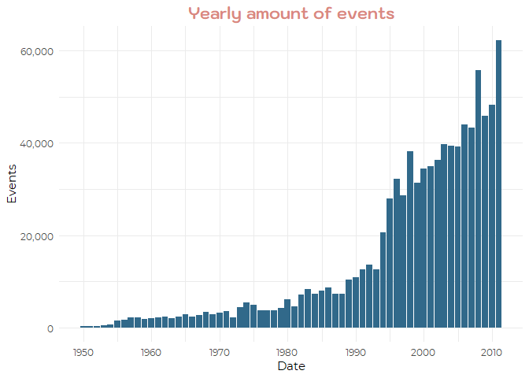

# Summary

<style>
div.blue { background-color : #7FB3D5; color : #ffffff; border-radius: 15px; padding: 15px 10px 10px 10px;}
</style>
<div class = "blue">

This report describes the impact of climate events on population health and the economy through the years from 1950 to 2011. The main goal of it is to identify which events are the most harmful. After exploratory analysis, I found out that the most dangerous for human health events are hurricane/typhoon, extreme heat, and tsunami and for the economy - hurricane/typhoon, storm surge, and severe thunderstorm.

</div>

# Data Processing

First of all, I prepared an environment for myself - uploaded all needed libraries (please check if you have all of them installed before proceeding) and created a theme for *ggplot* graphs.


```r
library(tidyverse)
library(extrafont)
library(scales)
library(lubridate)
library(xtable)
library(knitr)
library(kableExtra)
library(DT)
library(psych)

violet = '#D98880'
blue = '#31698a'
lightblue = '#7FB3D5'
pink = '#F2D7D5'

theme <- theme_minimal() +
    theme(plot.title = element_text(hjust = 0.5, 
                                    size = 16, 
                                    family = "Kodchasan", 
                                    colour = violet,
                                    face = "bold"),
          plot.subtitle = element_text(hjust = 0.5),
          text = element_text(family = "Montserrat"),
          legend.position = "bottom",
          strip.background = element_rect(fill = "white"),
          strip.text = element_text(colour = blue))
```

Secondly, I uploaded the data directly from the course website, saved it in *data* directory under my working directory and uploaded it to R as *raw_data*. If such directory didn't exist, the code would create it for me. 


```r
data_folder <- "data"

if (!file.exists(data_folder)){
    dir.create(data_folder)
}

download.file("https://d396qusza40orc.cloudfront.net/repdata%2Fdata%2FStormData.csv.bz2",
              "data/data.csv.bz2")

raw_data <- read_csv("data/data.csv.bz2")
```

Let's check what the data looks like and if we have any unusual values.


```r
glimpse(raw_data)
```

```
## Observations: 902,297
## Variables: 37
## $ STATE__    <dbl> 1, 1, 1, 1, 1, 1, 1, 1, 1, 1, 1, 1, 1, 1, 1, 1, 1, ...
## $ BGN_DATE   <chr> "4/18/1950 0:00:00", "4/18/1950 0:00:00", "2/20/195...
## $ BGN_TIME   <chr> "0130", "0145", "1600", "0900", "1500", "2000", "01...
## $ TIME_ZONE  <chr> "CST", "CST", "CST", "CST", "CST", "CST", "CST", "C...
## $ COUNTY     <dbl> 97, 3, 57, 89, 43, 77, 9, 123, 125, 57, 43, 9, 73, ...
## $ COUNTYNAME <chr> "MOBILE", "BALDWIN", "FAYETTE", "MADISON", "CULLMAN...
## $ STATE      <chr> "AL", "AL", "AL", "AL", "AL", "AL", "AL", "AL", "AL...
## $ EVTYPE     <chr> "TORNADO", "TORNADO", "TORNADO", "TORNADO", "TORNAD...
## $ BGN_RANGE  <dbl> 0, 0, 0, 0, 0, 0, 0, 0, 0, 0, 0, 0, 0, 0, 0, 0, 0, ...
## $ BGN_AZI    <chr> NA, NA, NA, NA, NA, NA, NA, NA, NA, NA, NA, NA, NA,...
## $ BGN_LOCATI <chr> NA, NA, NA, NA, NA, NA, NA, NA, NA, NA, NA, NA, NA,...
## $ END_DATE   <chr> NA, NA, NA, NA, NA, NA, NA, NA, NA, NA, NA, NA, NA,...
## $ END_TIME   <chr> NA, NA, NA, NA, NA, NA, NA, NA, NA, NA, NA, NA, NA,...
## $ COUNTY_END <dbl> 0, 0, 0, 0, 0, 0, 0, 0, 0, 0, 0, 0, 0, 0, 0, 0, 0, ...
## $ COUNTYENDN <chr> NA, NA, NA, NA, NA, NA, NA, NA, NA, NA, NA, NA, NA,...
## $ END_RANGE  <dbl> 0, 0, 0, 0, 0, 0, 0, 0, 0, 0, 0, 0, 0, 0, 0, 0, 0, ...
## $ END_AZI    <chr> NA, NA, NA, NA, NA, NA, NA, NA, NA, NA, NA, NA, NA,...
## $ END_LOCATI <chr> NA, NA, NA, NA, NA, NA, NA, NA, NA, NA, NA, NA, NA,...
## $ LENGTH     <dbl> 14.0, 2.0, 0.1, 0.0, 0.0, 1.5, 1.5, 0.0, 3.3, 2.3, ...
## $ WIDTH      <dbl> 100, 150, 123, 100, 150, 177, 33, 33, 100, 100, 400...
## $ F          <int> 3, 2, 2, 2, 2, 2, 2, 1, 3, 3, 1, 1, 3, 3, 3, 4, 1, ...
## $ MAG        <dbl> 0, 0, 0, 0, 0, 0, 0, 0, 0, 0, 0, 0, 0, 0, 0, 0, 0, ...
## $ FATALITIES <dbl> 0, 0, 0, 0, 0, 0, 0, 0, 1, 0, 0, 0, 1, 0, 0, 4, 0, ...
## $ INJURIES   <dbl> 15, 0, 2, 2, 2, 6, 1, 0, 14, 0, 3, 3, 26, 12, 6, 50...
## $ PROPDMG    <dbl> 25.0, 2.5, 25.0, 2.5, 2.5, 2.5, 2.5, 2.5, 25.0, 25....
## $ PROPDMGEXP <chr> "K", "K", "K", "K", "K", "K", "K", "K", "K", "K", "...
## $ CROPDMG    <dbl> 0, 0, 0, 0, 0, 0, 0, 0, 0, 0, 0, 0, 0, 0, 0, 0, 0, ...
## $ CROPDMGEXP <chr> NA, NA, NA, NA, NA, NA, NA, NA, NA, NA, NA, NA, NA,...
## $ WFO        <chr> NA, NA, NA, NA, NA, NA, NA, NA, NA, NA, NA, NA, NA,...
## $ STATEOFFIC <chr> NA, NA, NA, NA, NA, NA, NA, NA, NA, NA, NA, NA, NA,...
## $ ZONENAMES  <chr> NA, NA, NA, NA, NA, NA, NA, NA, NA, NA, NA, NA, NA,...
## $ LATITUDE   <dbl> 3040, 3042, 3340, 3458, 3412, 3450, 3405, 3255, 333...
## $ LONGITUDE  <dbl> 8812, 8755, 8742, 8626, 8642, 8748, 8631, 8558, 874...
## $ LATITUDE_E <dbl> 3051, 0, 0, 0, 0, 0, 0, 0, 3336, 3337, 3402, 3404, ...
## $ LONGITUDE_ <dbl> 8806, 0, 0, 0, 0, 0, 0, 0, 8738, 8737, 8644, 8640, ...
## $ REMARKS    <chr> NA, NA, NA, NA, NA, NA, NA, NA, NA, NA, NA, NA, NA,...
## $ REFNUM     <dbl> 1, 2, 3, 4, 5, 6, 7, 8, 9, 10, 11, 12, 13, 14, 15, ...
```

```r
summary(raw_data)
```

```
##     STATE__       BGN_DATE           BGN_TIME          TIME_ZONE        
##  Min.   : 1.0   Length:902297      Length:902297      Length:902297     
##  1st Qu.:19.0   Class :character   Class :character   Class :character  
##  Median :30.0   Mode  :character   Mode  :character   Mode  :character  
##  Mean   :31.2                                                           
##  3rd Qu.:45.0                                                           
##  Max.   :95.0                                                           
##                                                                         
##      COUNTY       COUNTYNAME           STATE              EVTYPE         
##  Min.   :  0.0   Length:902297      Length:902297      Length:902297     
##  1st Qu.: 31.0   Class :character   Class :character   Class :character  
##  Median : 75.0   Mode  :character   Mode  :character   Mode  :character  
##  Mean   :100.6                                                           
##  3rd Qu.:131.0                                                           
##  Max.   :873.0                                                           
##                                                                          
##    BGN_RANGE          BGN_AZI           BGN_LOCATI       
##  Min.   :   0.000   Length:902297      Length:902297     
##  1st Qu.:   0.000   Class :character   Class :character  
##  Median :   0.000   Mode  :character   Mode  :character  
##  Mean   :   1.484                                        
##  3rd Qu.:   1.000                                        
##  Max.   :3749.000                                        
##                                                          
##    END_DATE           END_TIME           COUNTY_END  COUNTYENDN       
##  Length:902297      Length:902297      Min.   :0    Length:902297     
##  Class :character   Class :character   1st Qu.:0    Class :character  
##  Mode  :character   Mode  :character   Median :0    Mode  :character  
##                                        Mean   :0                      
##                                        3rd Qu.:0                      
##                                        Max.   :0                      
##                                                                       
##    END_RANGE          END_AZI           END_LOCATI       
##  Min.   :  0.0000   Length:902297      Length:902297     
##  1st Qu.:  0.0000   Class :character   Class :character  
##  Median :  0.0000   Mode  :character   Mode  :character  
##  Mean   :  0.9862                                        
##  3rd Qu.:  0.0000                                        
##  Max.   :925.0000                                        
##                                                          
##      LENGTH              WIDTH                F               MAG         
##  Min.   :   0.0000   Min.   :   0.000   Min.   :0.0      Min.   :    0.0  
##  1st Qu.:   0.0000   1st Qu.:   0.000   1st Qu.:0.0      1st Qu.:    0.0  
##  Median :   0.0000   Median :   0.000   Median :1.0      Median :   50.0  
##  Mean   :   0.2301   Mean   :   7.503   Mean   :0.9      Mean   :   46.9  
##  3rd Qu.:   0.0000   3rd Qu.:   0.000   3rd Qu.:1.0      3rd Qu.:   75.0  
##  Max.   :2315.0000   Max.   :4400.000   Max.   :5.0      Max.   :22000.0  
##                                         NA's   :843563                    
##    FATALITIES          INJURIES            PROPDMG       
##  Min.   :  0.0000   Min.   :   0.0000   Min.   :   0.00  
##  1st Qu.:  0.0000   1st Qu.:   0.0000   1st Qu.:   0.00  
##  Median :  0.0000   Median :   0.0000   Median :   0.00  
##  Mean   :  0.0168   Mean   :   0.1557   Mean   :  12.06  
##  3rd Qu.:  0.0000   3rd Qu.:   0.0000   3rd Qu.:   0.50  
##  Max.   :583.0000   Max.   :1700.0000   Max.   :5000.00  
##                                                          
##   PROPDMGEXP           CROPDMG         CROPDMGEXP       
##  Length:902297      Min.   :  0.000   Length:902297     
##  Class :character   1st Qu.:  0.000   Class :character  
##  Mode  :character   Median :  0.000   Mode  :character  
##                     Mean   :  1.527                     
##                     3rd Qu.:  0.000                     
##                     Max.   :990.000                     
##                                                         
##      WFO             STATEOFFIC         ZONENAMES            LATITUDE   
##  Length:902297      Length:902297      Length:902297      Min.   :   0  
##  Class :character   Class :character   Class :character   1st Qu.:2802  
##  Mode  :character   Mode  :character   Mode  :character   Median :3540  
##                                                           Mean   :2875  
##                                                           3rd Qu.:4019  
##                                                           Max.   :9706  
##                                                           NA's   :47    
##    LONGITUDE        LATITUDE_E     LONGITUDE_       REMARKS         
##  Min.   :-14451   Min.   :   0   Min.   :-14455   Length:902297     
##  1st Qu.:  7247   1st Qu.:   0   1st Qu.:     0   Class :character  
##  Median :  8707   Median :   0   Median :     0   Mode  :character  
##  Mean   :  6940   Mean   :1452   Mean   :  3509                     
##  3rd Qu.:  9605   3rd Qu.:3549   3rd Qu.:  8735                     
##  Max.   : 17124   Max.   :9706   Max.   :106220                     
##                   NA's   :40                                        
##      REFNUM      
##  Min.   :     1  
##  1st Qu.:225575  
##  Median :451149  
##  Mean   :451149  
##  3rd Qu.:676723  
##  Max.   :902297  
## 
```

After seeing the structure of the data,  I decided to change the type of `BNG_DATE`, and `BNG_TYPE` as both of them were imported as character vectors and have them as `date` and `time` (plus `date_time` as their combination). Also, I already noticed that the columns for population health (`FATALITIES` and `INJURIES`) are full so no need to worry about empty values. The last thing I did was converted column names with *tolower()* and removed the only line with without proper event type value.


```r
proc_data <- raw_data %>%
    mutate(date = date(mdy_hms(BGN_DATE)),
           time = hms::as.hms(paste(substr(BGN_TIME, 1, 2), substr(BGN_TIME, 3, 2), '00', sep = ":")),
           date_time = date + time,
           propexp = case_when(PROPDMGEXP == "K" ~ 1000,
                               PROPDMGEXP == "M" ~ 1000000,
                               PROPDMGEXP == "B" ~ 1000000000,
                               TRUE ~ 1),
           cropexp = case_when(CROPDMGEXP == "K" ~ 1000,
                               CROPDMGEXP == "M" ~ 1000000,
                               CROPDMGEXP == "B" ~ 1000000000,
                               TRUE ~ 1)) %>%
    select(-BGN_TIME, -BGN_DATE) %>%
    filter(EVTYPE != "?")

names(proc_data) <- tolower(names(proc_data))

head(proc_data)
```

```
## # A tibble: 6 x 40
##   state__ time_zone county countyname state evtype bgn_range bgn_azi
##     <dbl> <chr>      <dbl> <chr>      <chr> <chr>      <dbl> <chr>  
## 1       1 CST           97 MOBILE     AL    TORNA~         0 <NA>   
## 2       1 CST            3 BALDWIN    AL    TORNA~         0 <NA>   
## 3       1 CST           57 FAYETTE    AL    TORNA~         0 <NA>   
## 4       1 CST           89 MADISON    AL    TORNA~         0 <NA>   
## 5       1 CST           43 CULLMAN    AL    TORNA~         0 <NA>   
## 6       1 CST           77 LAUDERDALE AL    TORNA~         0 <NA>   
## # ... with 32 more variables: bgn_locati <chr>, end_date <chr>,
## #   end_time <chr>, county_end <dbl>, countyendn <chr>, end_range <dbl>,
## #   end_azi <chr>, end_locati <chr>, length <dbl>, width <dbl>, f <int>,
## #   mag <dbl>, fatalities <dbl>, injuries <dbl>, propdmg <dbl>,
## #   propdmgexp <chr>, cropdmg <dbl>, cropdmgexp <chr>, wfo <chr>,
## #   stateoffic <chr>, zonenames <chr>, latitude <dbl>, longitude <dbl>,
## #   latitude_e <dbl>, longitude_ <dbl>, remarks <chr>, refnum <dbl>,
## #   date <date>, time <time>, date_time <date>, propexp <dbl>,
## #   cropexp <dbl>
```

# Overall stats

First I check how many events were measured every year. From the graph below, I can see that the amount of events is increasing exponentially and the main growth started in 1994. 


```r
proc_data %>%
    group_by(year = year(date)) %>%
    summarize(num = n()) %>%
    ggplot(aes(x = year,
               y = num)) +
    geom_col(fill = blue) +
    scale_y_continuous(labels = comma_format()) +
    scale_x_continuous(breaks = seq(1950, 2020, by = 10)) +
    labs(title = "Yearly amount of events",
         x = "Date",
         y = "Events") +
    theme
```



To understand what kind of plotting possibilities I have, I have checked how many different event types there are:


```r
unique_types <- length(unique(proc_data$evtype))
```

976 seems like a really big amount of factors to use in the plot so I decided to go with tables instead.

# Results

## Population Health

I checked the impact on population health by averaging amount of injuries and fatalities on each event. In the table below, I provided only the events with at least 10 occurrences in total and arranged by the total impact on population health.


```r
data_for_table <- proc_data %>%
    group_by(`Event Type` = evtype) %>%
    summarize(`Total Events` = n(),
              `Average Fatalities` = round(mean(fatalities, na.rm = TRUE), 2),
              `Average Injuries` = round(mean(injuries, na.rm = TRUE), 2),
              `Average Total Health` = round(mean(injuries + fatalities, na.rm = TRUE), 2)) %>%
    arrange(desc(`Average Total Health`)) %>%
    filter(`Total Events` >= 10)

datatable(data_for_table, rownames = FALSE, filter="top", options = list(pageLength = 5, scrollX=T))
```

<!--html_preserve--><div id="htmlwidget-def9a5de8d5cc78b83b4" style="width:100%;height:auto;" class="datatables html-widget"></div>
<script type="application/json" data-for="htmlwidget-def9a5de8d5cc78b83b4">{"x":{"filter":"top","filterHTML":"<tr>\n  <td data-type=\"character\" style=\"vertical-align: top;\">\n    <div class=\"form-group has-feedback\" style=\"margin-bottom: auto;\">\n      <input type=\"search\" placeholder=\"All\" class=\"form-control\" style=\"width: 100%;\"/>\n      <span class=\"glyphicon glyphicon-remove-circle form-control-feedback\"><\/span>\n    <\/div>\n  <\/td>\n  <td data-type=\"integer\" style=\"vertical-align: top;\">\n    <div class=\"form-group has-feedback\" style=\"margin-bottom: auto;\">\n      <input type=\"search\" placeholder=\"All\" class=\"form-control\" style=\"width: 100%;\"/>\n      <span class=\"glyphicon glyphicon-remove-circle form-control-feedback\"><\/span>\n    <\/div>\n    <div style=\"display: none; position: absolute; width: 200px;\">\n      <div data-min=\"10\" data-max=\"288661\"><\/div>\n      <span style=\"float: left;\"><\/span>\n      <span style=\"float: right;\"><\/span>\n    <\/div>\n  <\/td>\n  <td data-type=\"number\" style=\"vertical-align: top;\">\n    <div class=\"form-group has-feedback\" style=\"margin-bottom: auto;\">\n      <input type=\"search\" placeholder=\"All\" class=\"form-control\" style=\"width: 100%;\"/>\n      <span class=\"glyphicon glyphicon-remove-circle form-control-feedback\"><\/span>\n    <\/div>\n    <div style=\"display: none; position: absolute; width: 200px;\">\n      <div data-min=\"0\" data-max=\"4.37\" data-scale=\"2\"><\/div>\n      <span style=\"float: left;\"><\/span>\n      <span style=\"float: right;\"><\/span>\n    <\/div>\n  <\/td>\n  <td data-type=\"number\" style=\"vertical-align: top;\">\n    <div class=\"form-group has-feedback\" style=\"margin-bottom: auto;\">\n      <input type=\"search\" placeholder=\"All\" class=\"form-control\" style=\"width: 100%;\"/>\n      <span class=\"glyphicon glyphicon-remove-circle form-control-feedback\"><\/span>\n    <\/div>\n    <div style=\"display: none; position: absolute; width: 200px;\">\n      <div data-min=\"0\" data-max=\"14.49\" data-scale=\"2\"><\/div>\n      <span style=\"float: left;\"><\/span>\n      <span style=\"float: right;\"><\/span>\n    <\/div>\n  <\/td>\n  <td data-type=\"number\" style=\"vertical-align: top;\">\n    <div class=\"form-group has-feedback\" style=\"margin-bottom: auto;\">\n      <input type=\"search\" placeholder=\"All\" class=\"form-control\" style=\"width: 100%;\"/>\n      <span class=\"glyphicon glyphicon-remove-circle form-control-feedback\"><\/span>\n    <\/div>\n    <div style=\"display: none; position: absolute; width: 200px;\">\n      <div data-min=\"0\" data-max=\"15.22\" data-scale=\"2\"><\/div>\n      <span style=\"float: left;\"><\/span>\n      <span style=\"float: right;\"><\/span>\n    <\/div>\n  <\/td>\n<\/tr>","data":[["HURRICANE/TYPHOON","EXTREME HEAT","TSUNAMI","GLAZE","HEAT WAVE","EXCESSIVE HEAT","HEAT","MIXED PRECIP","ICE","UNSEASONABLY WARM AND DRY","SNOW SQUALL","BLACK ICE","RIP CURRENTS","TORNADO","FOG","ICY ROADS","RIP CURRENT","BLOWING SNOW","COLD","DUST STORM","ICE STORM","AVALANCHE","WINTRY MIX","FREEZING DRIZZLE","MARINE STRONG WIND","FLASH FLOOD/FLOOD","RECORD HEAT","HURRICANE","EXTREME COLD","TROPICAL STORM","HEAVY SURF","TYPHOON","HEAVY SURF/HIGH SURF","LIGHTNING","WILD/FOREST FIRE","WILDFIRE","HIGH SURF","BLIZZARD","WIND","DUST DEVIL","Cold","FLOOD","THUNDERSTORM","DENSE FOG","GUSTY WINDS","HIGH WINDS","UNSEASONABLY WARM","SMALL HAIL","COLD/WIND CHILL","STORM SURGE","DRY MICROBURST","DROUGHT/EXCESSIVE HEAT","EXTREME COLD/WIND CHILL","HEAVY RAINS","LANDSLIDE","SNOW AND ICE","STRONG WINDS","WINTER STORM","FREEZING RAIN","EXTREME WINDCHILL","STORM SURGE/TIDE","STRONG WIND","Gusty Winds","TSTM WIND (G40)","TSTM WIND/HAIL","GUSTY WIND","UNSEASONABLY COLD","WINTER WEATHER/MIX","EXCESSIVE SNOW","FROST","OTHER","RIVER FLOODING","THUNDERSTORM WINDSS","TSTM WIND (G45)","FLOODING","HEAVY SNOW","HIGH WIND","Snow","THUNDERSTORMS WINDS","FLASH FLOODS","SNOW","WINDS","WINTER WEATHER","Coastal Flooding","FLASH FLOOD","FLOOD/FLASH FLOOD","THUNDERSTORM WINDS","TIDAL FLOODING","FLASH FLOODING","THUNDERSTORM WINDS/HAIL","HEAVY RAIN","SLEET","TSTM WIND","URBAN/SML STREAM FLD","LIGHT SNOW","RECORD COLD","RIVER FLOOD","THUNDERSTORM WIND","COASTAL FLOOD","COASTAL FLOODING","FREEZE","MARINE HIGH WIND","MARINE THUNDERSTORM WIND","WATERSPOUT","ASTRONOMICAL HIGH TIDE","ASTRONOMICAL LOW TIDE","DENSE SMOKE","DROUGHT","EXTREME WINDCHILL TEMPERATURES","FREEZING FOG","FROST/FREEZE","FUNNEL","FUNNEL CLOUD","FUNNEL CLOUDS","Glaze","HAIL","HAIL 0.75","HAIL 100","HAIL 175","HAIL 75","HEAVY LAKE SNOW","Heavy Rain","HEAVY SNOW-SQUALLS","HEAVY SNOW SQUALLS","LAKE-EFFECT SNOW","LAKE EFFECT SNOW","LAKESHORE FLOOD","LIGHT FREEZING RAIN","Light Snow","MARINE HAIL","MARINE TSTM WIND","MIXED PRECIPITATION","MODERATE SNOWFALL","MONTHLY PRECIPITATION","MONTHLY RAINFALL","PROLONG COLD","RAIN","RECORD RAINFALL","Record temperature","RECORD WARMTH","SEICHE","SEVERE THUNDERSTORM","SEVERE THUNDERSTORMS","SLEET STORM","SMOKE","SNOW FREEZING RAIN","SNOW SQUALLS","SNOW/ICE STORM","SNOW/SLEET","Temperature record","THUNDERSTORM WINDS HAIL","TORNADO F0","TROPICAL DEPRESSION","UNSEASONABLY COOL","UNSEASONABLY DRY","UNSEASONABLY HOT","UNSEASONABLY WET","UNUSUAL WARMTH","URBAN FLOOD","URBAN FLOODING","URBAN/SMALL STREAM FLOOD","VOLCANIC ASH","WATERSPOUT-","WATERSPOUTS","WIND ADVISORY","WIND CHILL","WIND DAMAGE","Winter Weather"],[88,22,20,32,74,1678,767,10,61,13,19,14,304,60652,538,28,470,12,72,427,2006,386,90,20,48,22,81,174,655,690,84,11,228,15755,1457,2761,725,2719,341,141,10,25326,45,1293,53,1533,126,47,539,261,186,13,1002,26,600,33,196,11433,250,204,148,3566,10,10,1028,23,23,1104,25,53,48,24,51,40,120,15708,20212,30,14,32,587,36,7026,38,54278,624,20843,20,682,24,11723,59,219944,3392,154,64,173,82563,651,143,74,135,5812,3797,103,174,10,2488,19,45,1342,46,6839,87,11,288661,18,13,13,29,25,16,15,32,636,21,23,23,21,442,6175,34,101,36,11,17,16,14,11,146,21,13,23,12,11,11,17,17,10,43,61,19,60,12,56,10,19,10,249,98,30,22,10,37,12,18,27,19],[0.73,4.36,1.65,0.22,2.32,1.13,1.22,0.2,0.1,2.23,0.11,0.07,0.67,0.09,0.12,0.18,0.78,0.08,0.49,0.05,0.04,0.58,0.01,0.1,0.29,0.64,0.02,0.35,0.24,0.08,0.08,0,0.18,0.05,0.01,0.03,0.14,0.04,0.07,0.01,0.3,0.02,0.02,0.01,0.08,0.02,0.09,0,0.18,0.05,0.02,0.15,0.12,0,0.06,0.12,0.04,0.02,0.03,0.08,0.07,0.03,0,0,0,0.04,0.09,0.03,0,0.02,0,0.08,0,0,0.05,0.01,0.01,0,0,0.06,0.01,0.03,0,0.05,0.02,0.03,0,0,0.03,0,0.01,0.03,0,0.01,0.01,0.02,0.01,0,0,0.01,0.01,0.01,0,0,0,0,0,0,0,0,0,0,0,0,0,0,0,0,0,0,0,0,0,0,0,0,0,0,0,0,0,0,0,0,0,0,0,0,0,0,0,0,0,0,0,0,0,0,0,0,0,0,0,0,0,0,0,0,0,0,0,0,0,0,0,0,0,0],[14.49,7.05,6.45,6.75,4.18,3.89,2.74,2.6,2.25,0,1.84,1.71,0.98,1.51,1.36,1.11,0.49,1.08,0.67,1.03,0.98,0.44,0.86,0.75,0.46,0,0.62,0.26,0.35,0.49,0.48,0.45,0.21,0.33,0.37,0.33,0.21,0.3,0.25,0.3,0,0.27,0.27,0.26,0.15,0.2,0.13,0.21,0.02,0.15,0.15,0,0.02,0.15,0.09,0.03,0.11,0.12,0.09,0.02,0.03,0.08,0.1,0.1,0.09,0.04,0,0.07,0.08,0.06,0.08,0,0.08,0.08,0.02,0.06,0.06,0.07,0.07,0,0.05,0.03,0.06,0,0.03,0.02,0.04,0.05,0.01,0.04,0.02,0,0.03,0.02,0.01,0,0.01,0.02,0,0,0,0.01,0,0.01,0,0,0,0,0,0,0,0,0,0,0,0,0,0,0,0,0,0,0,0,0,0,0,0,0,0,0,0,0,0,0,0,0,0,0,0,0,0,0,0,0,0,0,0,0,0,0,0,0,0,0,0,0,0,0,0,0,0,0,0,0,0,0,0],[15.22,11.41,8.1,6.97,6.5,5.02,3.96,2.8,2.34,2.23,1.95,1.79,1.65,1.6,1.48,1.29,1.28,1.17,1.15,1.08,1.03,1.02,0.87,0.85,0.75,0.64,0.64,0.61,0.6,0.58,0.56,0.45,0.39,0.38,0.38,0.36,0.35,0.33,0.32,0.31,0.3,0.29,0.29,0.28,0.23,0.22,0.22,0.21,0.2,0.2,0.17,0.15,0.15,0.15,0.15,0.15,0.14,0.13,0.12,0.11,0.11,0.11,0.1,0.1,0.1,0.09,0.09,0.09,0.08,0.08,0.08,0.08,0.08,0.08,0.07,0.07,0.07,0.07,0.07,0.06,0.06,0.06,0.06,0.05,0.05,0.05,0.05,0.05,0.04,0.04,0.03,0.03,0.03,0.03,0.02,0.02,0.02,0.02,0.01,0.01,0.01,0.01,0.01,0.01,0,0,0,0,0,0,0,0,0,0,0,0,0,0,0,0,0,0,0,0,0,0,0,0,0,0,0,0,0,0,0,0,0,0,0,0,0,0,0,0,0,0,0,0,0,0,0,0,0,0,0,0,0,0,0,0,0,0,0,0,0,0,0,0]],"container":"<table class=\"display\">\n  <thead>\n    <tr>\n      <th>Event Type<\/th>\n      <th>Total Events<\/th>\n      <th>Average Fatalities<\/th>\n      <th>Average Injuries<\/th>\n      <th>Average Total Health<\/th>\n    <\/tr>\n  <\/thead>\n<\/table>","options":{"pageLength":5,"scrollX":true,"columnDefs":[{"className":"dt-right","targets":[1,2,3,4]}],"order":[],"autoWidth":false,"orderClasses":false,"orderCellsTop":true,"lengthMenu":[5,10,25,50,100]}},"evals":[],"jsHooks":[]}</script><!--/html_preserve-->

The most dangerous for human health events are hurricane/typhoon, extreme heat, and tsunami.

## Economy

I checked the impact on the economy by averaging the damage by each event. In the table below, I provided only the events with at least 10 occurrences in total and arranged by the total impact on the economy.


```r
data_for_table <- proc_data %>%
    group_by(`Event Type` = evtype) %>%
    summarize(`Total Events` = n(),
              `Mean Flood Damage (K USD)` = round(mean(propexp * propdmg, na.rm = TRUE) / 1000, 2),
              `Mean Crop Damage (K USD)` = round(mean(cropexp * cropdmg, na.rm = TRUE) / 1000, 2),
              `Mean Damage (K USD)` = round(mean(propexp * propdmg + cropexp * cropdmg, na.rm = TRUE) / 1000, 2)) %>%
    arrange(desc(`Mean Damage (K USD)`)) %>%
    filter(`Total Events` >= 10)

datatable(data_for_table, rownames = FALSE, filter="top", options = list(pageLength = 5, scrollX=T))
```

<!--html_preserve--><div id="htmlwidget-0a865659450c05778e8a" style="width:100%;height:auto;" class="datatables html-widget"></div>
<script type="application/json" data-for="htmlwidget-0a865659450c05778e8a">{"x":{"filter":"top","filterHTML":"<tr>\n  <td data-type=\"character\" style=\"vertical-align: top;\">\n    <div class=\"form-group has-feedback\" style=\"margin-bottom: auto;\">\n      <input type=\"search\" placeholder=\"All\" class=\"form-control\" style=\"width: 100%;\"/>\n      <span class=\"glyphicon glyphicon-remove-circle form-control-feedback\"><\/span>\n    <\/div>\n  <\/td>\n  <td data-type=\"integer\" style=\"vertical-align: top;\">\n    <div class=\"form-group has-feedback\" style=\"margin-bottom: auto;\">\n      <input type=\"search\" placeholder=\"All\" class=\"form-control\" style=\"width: 100%;\"/>\n      <span class=\"glyphicon glyphicon-remove-circle form-control-feedback\"><\/span>\n    <\/div>\n    <div style=\"display: none; position: absolute; width: 200px;\">\n      <div data-min=\"10\" data-max=\"288661\"><\/div>\n      <span style=\"float: left;\"><\/span>\n      <span style=\"float: right;\"><\/span>\n    <\/div>\n  <\/td>\n  <td data-type=\"number\" style=\"vertical-align: top;\">\n    <div class=\"form-group has-feedback\" style=\"margin-bottom: auto;\">\n      <input type=\"search\" placeholder=\"All\" class=\"form-control\" style=\"width: 100%;\"/>\n      <span class=\"glyphicon glyphicon-remove-circle form-control-feedback\"><\/span>\n    <\/div>\n    <div style=\"display: none; position: absolute; width: 200px;\">\n      <div data-min=\"0\" data-max=\"787566.36\" data-scale=\"2\"><\/div>\n      <span style=\"float: left;\"><\/span>\n      <span style=\"float: right;\"><\/span>\n    <\/div>\n  <\/td>\n  <td data-type=\"number\" style=\"vertical-align: top;\">\n    <div class=\"form-group has-feedback\" style=\"margin-bottom: auto;\">\n      <input type=\"search\" placeholder=\"All\" class=\"form-control\" style=\"width: 100%;\"/>\n      <span class=\"glyphicon glyphicon-remove-circle form-control-feedback\"><\/span>\n    <\/div>\n    <div style=\"display: none; position: absolute; width: 200px;\">\n      <div data-min=\"0\" data-max=\"29634.92\" data-scale=\"2\"><\/div>\n      <span style=\"float: left;\"><\/span>\n      <span style=\"float: right;\"><\/span>\n    <\/div>\n  <\/td>\n  <td data-type=\"number\" style=\"vertical-align: top;\">\n    <div class=\"form-group has-feedback\" style=\"margin-bottom: auto;\">\n      <input type=\"search\" placeholder=\"All\" class=\"form-control\" style=\"width: 100%;\"/>\n      <span class=\"glyphicon glyphicon-remove-circle form-control-feedback\"><\/span>\n    <\/div>\n    <div style=\"display: none; position: absolute; width: 200px;\">\n      <div data-min=\"0\" data-max=\"817201.28\" data-scale=\"2\"><\/div>\n      <span style=\"float: left;\"><\/span>\n      <span style=\"float: right;\"><\/span>\n    <\/div>\n  <\/td>\n<\/tr>","data":[["HURRICANE/TYPHOON","STORM SURGE","SEVERE THUNDERSTORM","HURRICANE","RIVER FLOOD","TYPHOON","STORM SURGE/TIDE","FLASH FLOOD/FLOOD","TROPICAL STORM","TSUNAMI","DROUGHT","FREEZE","FLOOD","ICE STORM","HEAVY RAINS","WILD/FOREST FIRE","EXTREME COLD","WILDFIRE","FROST","UNSEASONABLY COLD","FLOODING","TORNADO","COASTAL FLOODING","RECORD COLD","SEVERE THUNDERSTORMS","FROST/FREEZE","WINTER STORM","LANDSLIDE","HEAT","FLASH FLOODING","SMALL HAIL","FLOOD/FLASH FLOOD","HIGH WINDS","RIVER FLOODING","RAIN","COASTAL FLOOD","LAKESHORE FLOOD","FLASH FLOOD","EXCESSIVE HEAT","HIGH WIND","BLIZZARD","FLASH FLOODS","EXTREME HEAT","HEAT WAVE","ICE","Coastal Flooding","SNOW/SLEET","HIGH SURF","HEAVY RAIN","SNOW FREEZING RAIN","TSTM WIND/HAIL","Gusty Winds","THUNDERSTORM WINDS","ASTRONOMICAL HIGH TIDE","EXTREME WINDCHILL","EXCESSIVE SNOW","URBAN FLOOD","HEAVY SNOW","STRONG WIND","HAIL","LAKE-EFFECT SNOW","URBAN FLOODING","LIGHTNING","FREEZING FOG","THUNDERSTORM WIND","SEICHE","HEAVY SURF/HIGH SURF","THUNDERSTORM","SNOW SQUALLS","STRONG WINDS","THUNDERSTORM WINDSS","THUNDERSTORMS WINDS","DRY MICROBURST","SNOW SQUALL","FREEZING RAIN","WINDS","TROPICAL DEPRESSION","GLAZE","Light Snow","WIND","SNOW","FOG","TSTM WIND","VOLCANIC ASH","OTHER","HEAVY SNOW SQUALLS","WATERSPOUT-","DUST STORM","HEAVY LAKE SNOW","URBAN/SML STREAM FLD","LIGHT FREEZING RAIN","HEAVY SURF","THUNDERSTORM WINDS/HAIL","MIXED PRECIPITATION","GUSTY WIND","LIGHT SNOW","ICY ROADS","THUNDERSTORM WINDS HAIL","GUSTY WINDS","DENSE SMOKE","AVALANCHE","MARINE HIGH WIND","HAIL 175","MARINE STRONG WIND","EXTREME COLD/WIND CHILL","Glaze","DENSE FOG","COLD","SNOW/ICE STORM","HEAVY SNOW-SQUALLS","WINTER WEATHER/MIX","TSTM WIND (G45)","Cold","WINTER WEATHER","DUST DEVIL","COLD/WIND CHILL","WIND DAMAGE","TSTM WIND (G40)","TORNADO F0","FREEZING DRIZZLE","WATERSPOUT","Snow","ASTRONOMICAL LOW TIDE","URBAN/SMALL STREAM FLOOD","HAIL 100","MARINE TSTM WIND","LAKE EFFECT SNOW","RIP CURRENTS","DROUGHT/EXCESSIVE HEAT","TIDAL FLOODING","WINTRY MIX","MARINE THUNDERSTORM WIND","UNSEASONABLY WARM","HAIL 0.75","RECORD RAINFALL","FUNNEL CLOUD","HAIL 75","MARINE HAIL","BLACK ICE","BLOWING SNOW","EXTREME WINDCHILL TEMPERATURES","FUNNEL","FUNNEL CLOUDS","Heavy Rain","MIXED PRECIP","MODERATE SNOWFALL","MONTHLY PRECIPITATION","MONTHLY RAINFALL","PROLONG COLD","RECORD HEAT","Record temperature","RECORD WARMTH","RIP CURRENT","SLEET","SLEET STORM","SMOKE","SNOW AND ICE","Temperature record","UNSEASONABLY COOL","UNSEASONABLY DRY","UNSEASONABLY HOT","UNSEASONABLY WARM AND DRY","UNSEASONABLY WET","UNUSUAL WARMTH","WATERSPOUTS","WIND ADVISORY","WIND CHILL","Winter Weather"],[88,261,13,174,173,11,148,22,690,20,2488,74,25326,2006,26,1457,655,2761,53,23,120,60652,143,64,23,1342,11433,600,767,682,47,624,1533,24,16,651,23,54278,1678,20212,2719,32,22,74,61,38,10,725,11723,11,1028,10,20843,103,204,25,249,15708,3566,288661,636,98,15755,45,82563,21,228,45,17,196,51,14,186,19,250,36,60,32,21,341,587,538,219944,22,48,32,10,427,25,3392,23,84,24,34,23,154,28,61,53,10,386,135,13,48,1002,11,1293,72,17,15,1104,40,10,7026,141,539,27,10,19,20,3797,30,174,30,13,6175,21,304,13,20,90,5812,126,18,14,6839,29,442,14,12,19,46,87,16,10,101,36,11,17,81,11,146,470,59,12,11,33,43,12,56,10,13,19,10,37,12,18,19],[787566.36,165990.56,92720,68208.73,29589.28,54566.36,31359.38,12384.09,11165.06,7203.1,420.46,2.77,5711.83,1966.56,472.5,2060.28,103.42,1725.87,0.28,0,902.13,938.56,885.6,875,86.96,7.06,585.02,540.99,2.34,451.27,1.49,278.91,396.82,422.46,331.25,365.08,327.83,297.37,4.62,260.74,242.45,272.77,5.23,141.35,207.46,166.45,135,123.55,59.22,118.64,43.13,93.8,83.17,91.5,3.7,77.4,73.45,59.37,49.14,54.48,63.07,57.2,58.94,48.49,42.19,46.67,43.29,20.46,40,11.81,35.99,36.65,36.2,35.79,32.45,17.94,28.95,28.44,28.1,25.47,25.15,24.45,20.43,22.73,0.11,21.41,21.05,13,20,17.19,19.61,16.55,15.21,16.32,15.65,12.45,12.19,11.16,6.47,10,9.64,9.61,9.23,8.72,8.63,8.18,7.48,6.94,5.88,5.87,5.77,5.74,5.4,2.97,4.97,3.69,2.85,4.5,4.01,3.75,2.46,2.17,1.84,1.7,0.38,0.88,0.81,0.53,0,0.15,0.11,0.08,0,0.06,0.04,0.03,0.03,0.01,0,0,0,0,0,0,0,0,0,0,0,0,0,0,0,0,0,0,0,0,0,0,0,0,0,0,0,0,0,0],[29634.92,0.02,15.38,15758.1,29072.02,75,5.74,25.23,983.11,1,5615.98,6030.07,223.56,2503.55,2326.92,73.3,1974,107.02,1245.28,1088.8,73.8,6.84,0.39,0,739.13,815.27,2.36,33.36,523.42,22.15,442.4,152.3,26.56,0.21,46.88,0,0,26.19,293.45,31.59,41.21,0,227.27,75,0,0,0,0,62.56,0,62.93,0,9.15,0,83.33,0,3.71,8.57,18.21,10.48,0,3.74,0.77,0,5.02,0,0,22.22,0,25.51,1.17,0.07,0.08,0,0,14.03,0,0,0,0.88,0.02,0,2.52,0,21.55,0,0,7.26,0,2.5,0,0,1.25,0,0.43,0,0,0.8,3.77,0,0,0,0,0,0.05,0,0,0,0,0,0,0,0,2.13,0,1.11,1.85,0,0.38,0,0,0,0,0,0.77,0,0,0,0.44,0,0,0.01,0.08,0,0,0,0,0,0,0,0,0,0,0,0,0,0,0,0,0,0,0,0,0,0,0,0,0,0,0,0,0,0,0,0,0,0,0],[817201.28,165990.58,92735.38,83966.83,58661.3,54641.36,31365.12,12409.32,12148.17,7204.1,6036.44,6032.84,5935.39,4470.11,2799.43,2133.58,2077.42,1832.88,1245.57,1088.8,975.92,945.4,885.99,875,826.09,822.33,587.37,574.36,525.76,473.42,443.89,431.21,423.38,422.67,378.13,365.08,327.83,323.56,298.07,292.33,283.66,272.77,232.5,216.35,207.46,166.45,135,123.55,121.78,118.64,106.06,93.8,92.31,91.5,87.03,77.4,77.15,67.94,67.36,64.97,63.07,60.94,59.71,48.49,47.21,46.67,43.29,42.68,40,37.32,37.16,36.72,36.28,35.79,32.45,31.97,28.95,28.44,28.1,26.35,25.17,24.45,22.95,22.73,21.66,21.41,21.05,20.26,20,19.69,19.61,16.55,16.46,16.32,16.09,12.45,12.19,11.97,10.25,10,9.64,9.61,9.23,8.72,8.68,8.18,7.48,6.94,5.88,5.87,5.77,5.74,5.4,5.1,4.97,4.81,4.7,4.5,4.39,3.75,2.46,2.17,1.84,1.7,1.15,0.88,0.81,0.53,0.44,0.15,0.11,0.08,0.08,0.06,0.04,0.03,0.03,0.01,0,0,0,0,0,0,0,0,0,0,0,0,0,0,0,0,0,0,0,0,0,0,0,0,0,0,0,0,0,0]],"container":"<table class=\"display\">\n  <thead>\n    <tr>\n      <th>Event Type<\/th>\n      <th>Total Events<\/th>\n      <th>Mean Flood Damage (K USD)<\/th>\n      <th>Mean Crop Damage (K USD)<\/th>\n      <th>Mean Damage (K USD)<\/th>\n    <\/tr>\n  <\/thead>\n<\/table>","options":{"pageLength":5,"scrollX":true,"columnDefs":[{"className":"dt-right","targets":[1,2,3,4]}],"order":[],"autoWidth":false,"orderClasses":false,"orderCellsTop":true,"lengthMenu":[5,10,25,50,100]}},"evals":[],"jsHooks":[]}</script><!--/html_preserve-->

The biggest damage on the economy is done by hurricane/typhoon, storm surge, and severe thunderstorm.
